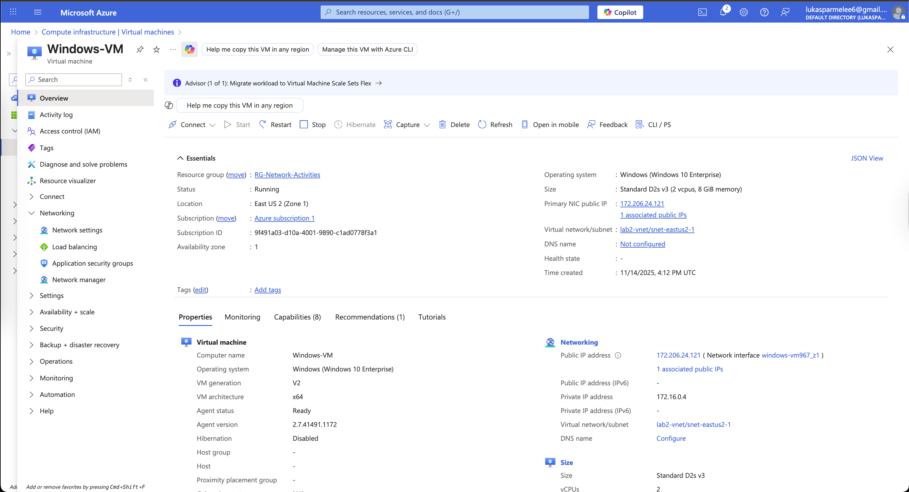
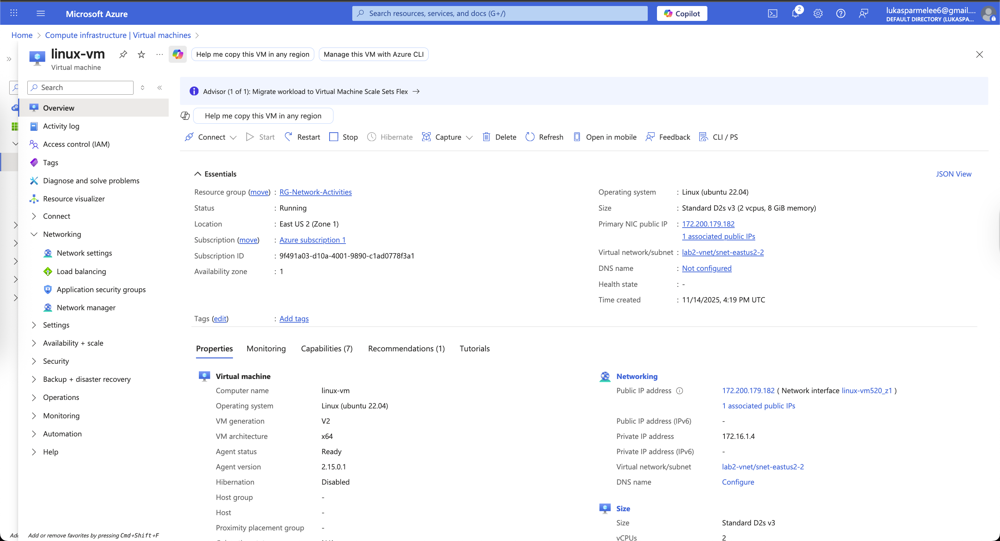
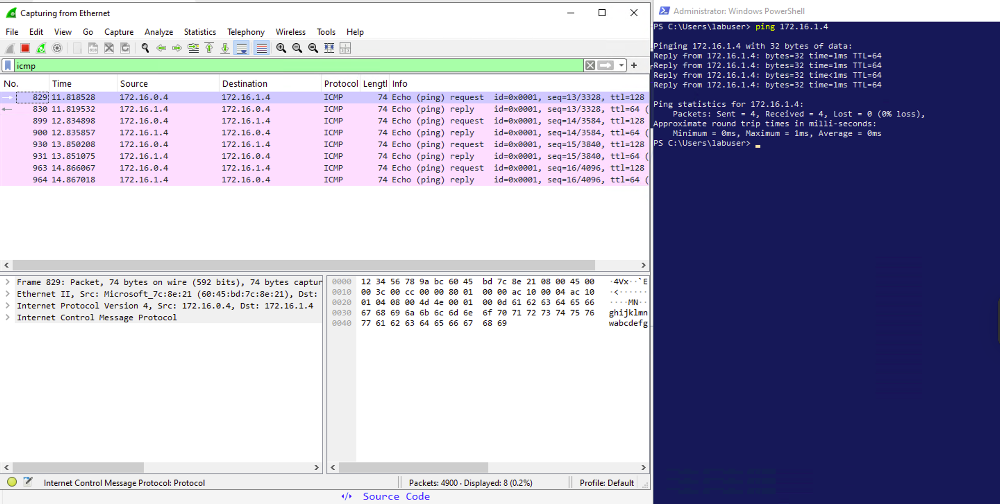
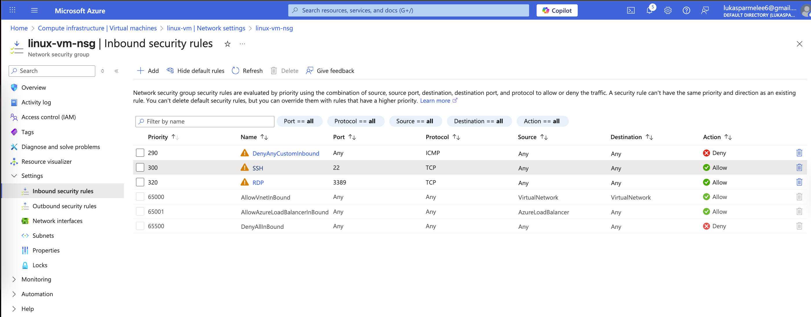
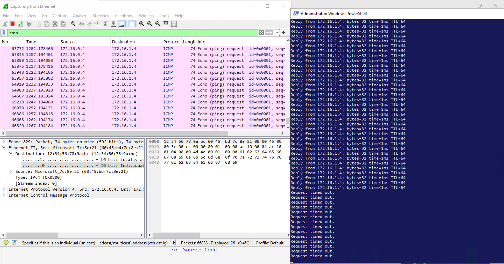
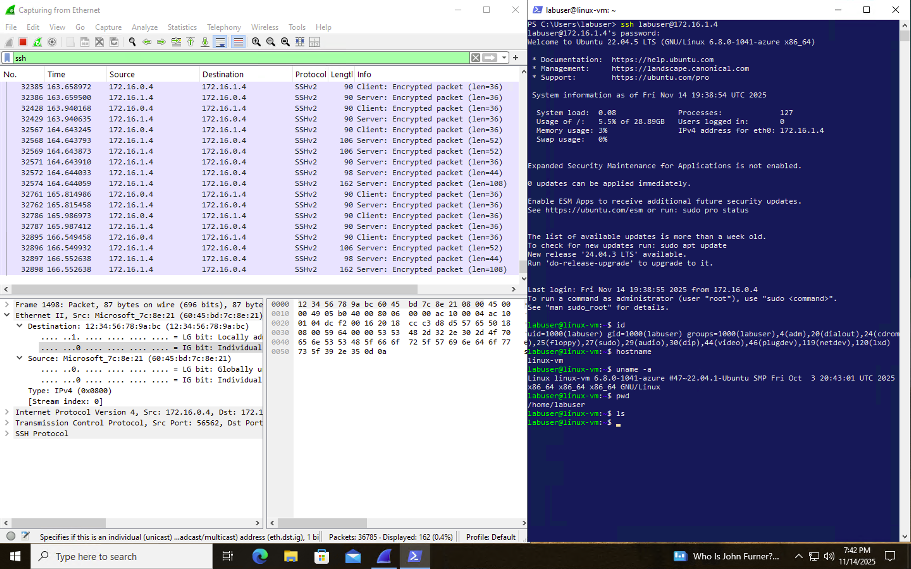
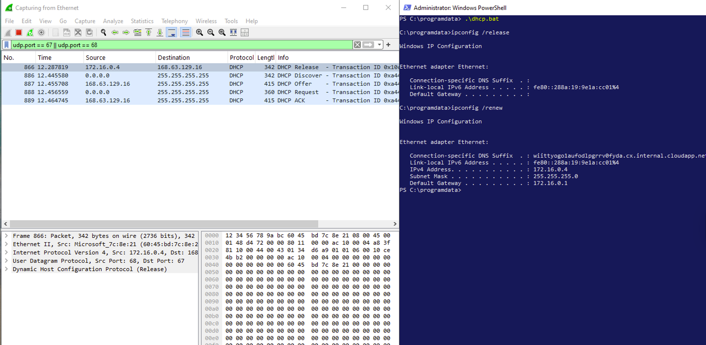
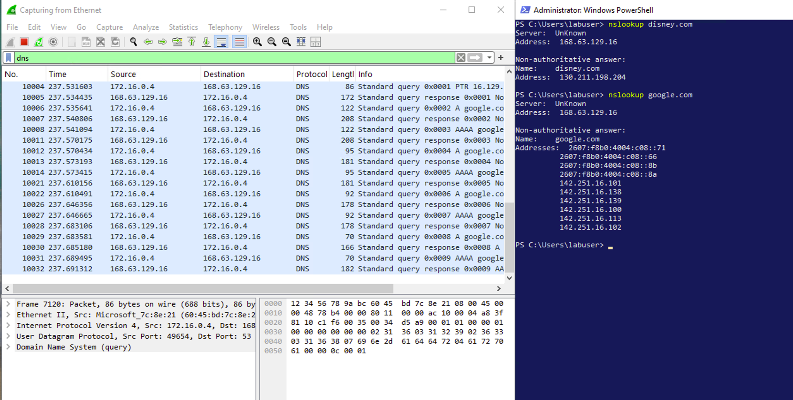
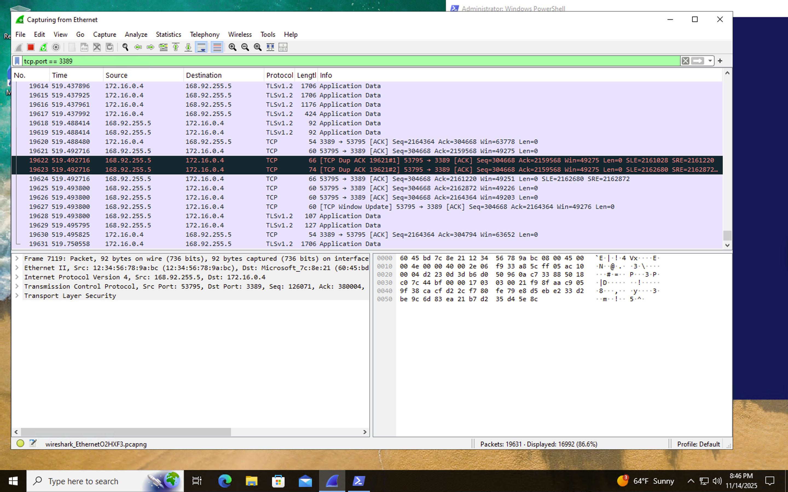

  

<h1>Network Security Groups (NSGs) and Inspecting Traffic Between Azure Virtual Machines</h1>
In this tutorial, we observe various network traffic to and from Azure Virtual Machines using Wireshark and experiment with Network Security Groups (NSGs) to understand how traffic filtering impacts communication between systems.  

---

<h2>🎥 Video Demonstration</h2>

- ### [YouTube: Azure Virtual Machines, Wireshark, and Network Security Groups](https://www.youtube.com)

---

<h2>🧠 Environments and Technologies Used</h2>

- Microsoft Azure (Virtual Machines / Compute)
- Remote Desktop Protocol (RDP)
- PowerShell & Linux Command-Line Tools
- Wireshark (Protocol Analyzer)
- Network Protocols: ICMP, SSH, DHCP, DNS, RDP

---

<h2>💻 Operating Systems Used</h2>

- Windows 10 (21H2)
- Ubuntu 22.04 LTS

---

<h2>⚙️ High-Level Steps</h2>

- Create Resource Group and Virtual Machines in Azure  
- Capture and Analyze Network Traffic with Wireshark  
- Configure Network Security Groups (Firewall)  
- Observe Network Protocols (ICMP, SSH, DHCP, DNS, RDP)  
- Clean Up Azure Resources  

---

<h2>🧩 Actions and Observations</h2>

### **Part 1: Creating Virtual Machines**

  
  

In the Azure Portal, a new Resource Group was created along with two Virtual Machines: a Windows 10 VM and an Ubuntu (Linux) VM. Both were placed within the same Virtual Network (VNet) and Subnet to enable internal communication.

- Resource Group: <code>RG-Network-Activities</code>  
- Network: <code>lab2-vnet</code>  
- Authentication: Username: labuser / Password: Cyberlab123!
- Validation: Both VMs successfully connected within the same private network.  

✅ **Result:** Two connected VMs in one virtual network.

---

### **Part 2: Observing ICMP Traffic**

  

Wireshark was installed on the Windows 10 VM to capture ICMP traffic. A ping command was sent to the Ubuntu VM's private IP address, and ICMP Echo Requests and Replies were successfully observed in real-time within Wireshark.

---

<h3>Part 3: Configuring Network Security Group (Firewall)</h3>

  
  
  

A continuous ping was initiated from the Windows VM to the Ubuntu VM. The inbound ICMP rule was then created in the Ubuntu VM’s Network Security Group (NSG).  
Ping requests immediately began timing out, and Wireshark confirmed that no ICMP replies were received.

---

  

After deleting the ICMP rule in the NSG, connectivity was restored and the pings resumed successfully.

---

<h3>Part 4: Observing SSH Traffic</h3>

  

After restoring ICMP connectivity, I moved on to capture and analyze SSH traffic. In Wireshark, I applied the SSH filter and initiated an SSH session from the Windows VM to the Ubuntu VM using PowerShell.

Once connected, I entered several basic commands such as <code>pwd</code> and <code>ls</code> to generate traffic. Wireshark displayed continuous encrypted SSH packets representing command execution and communication between the two virtual machines. After verifying the session, I exited the SSH connection.

---

<h3>Part 5: Observing DHCP Traffic</h3>

  

To observe DHCP behavior, I filtered Wireshark using the <code>udp.port == 67 || udp.port == 68</code> keyword and initiated a DHCP renewal on the Windows 10 VM.

I ran ipconfig /release and ipconfig /renew this triggered DHCP Discover, Offer, Request, and Acknowledge packets, visible in real-time on Wireshark. The process confirmed how the VM requests a new IP lease from the DHCP server on the network.

---

<h3>Part 6: Observing DNS Traffic</h3>

  

Next, I analyzed DNS queries to external domains. In Wireshark, I filtered for <code>dns</code> traffic, then used the <code>nslookup</code> tool to query multiple websites.

Wireshark displayed DNS Query and Response packets, confirming domain name resolution and returning the appropriate IP addresses for each domain.

---

<h3>Part 7: Observing RDP Traffic</h3>

  

Finally, I captured Remote Desktop Protocol (RDP) traffic between my local machine and the Windows VM.  
Wireshark was filtered to show only RDP packets using the expression:

RDP traffic appeared as continuous packet streams because the protocol constantly transmits live screen updates, keyboard input, and mouse activity in real-time.

---

<h2>🧰 Skills Demonstrated</h2>

- Azure Resource Group and Virtual Machine Management
- Virtual Network and Subnet Configuration
- Wireshark Packet Capture and Traffic Analysis
- Network Security Group (Firewall) Configuration
- Network Troubleshooting and Connectivity Testing
- DNS, DHCP, SSH, ICMP, and RDP Protocol Analysis
- Documentation and Professional Reporting

